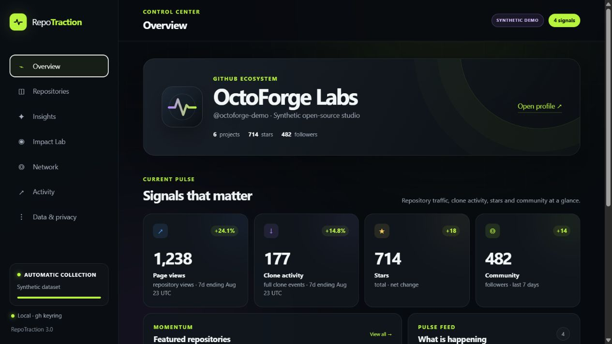
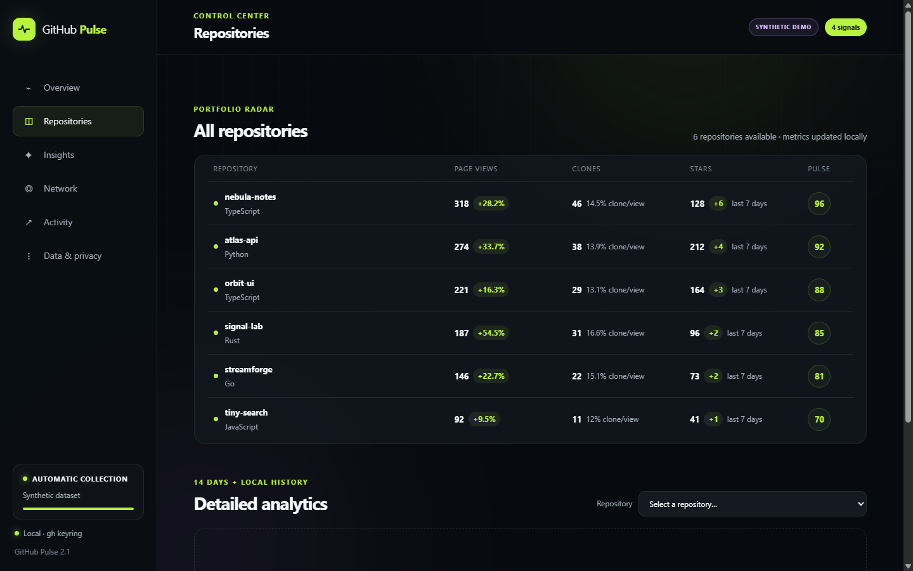
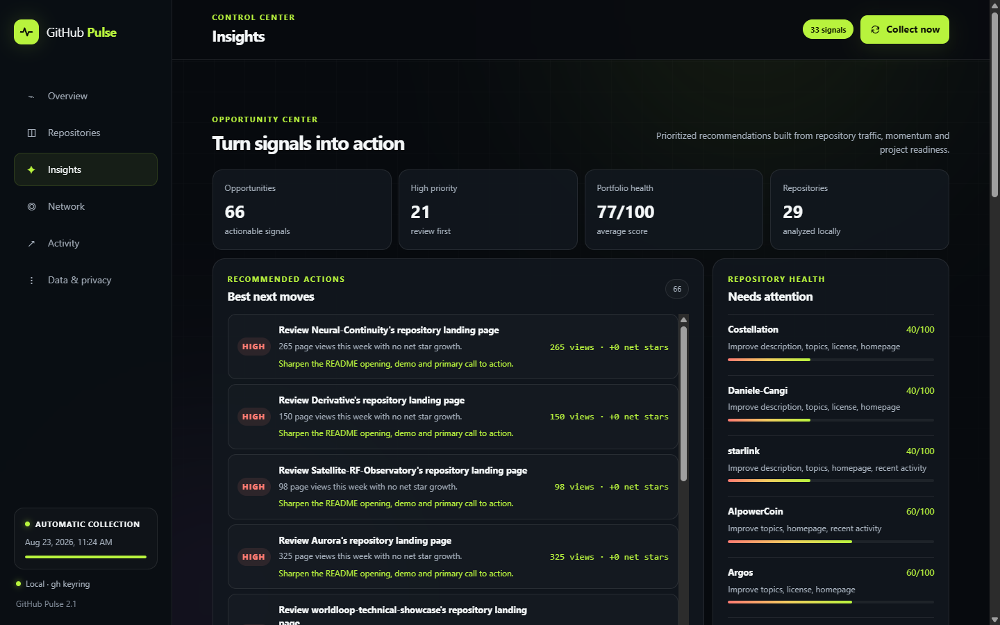

# GitHub Pulse

### Your local-first GitHub intelligence dashboard

Turn repository traffic, stars, clones, activity and community changes into signals you can actually use.

> The screenshots use GitHub Pulse's built-in synthetic demo profile. They do
> not contain data from a real GitHub account.

GitHub Pulse is a self-hosted control center for the account currently active in
[GitHub CLI](https://cli.github.com/). It runs on your computer, reads GitHub
through the authenticated <code>gh</code> session and stores historical data in
a local SQLite database.

There is no username to configure and no token to paste into the app.

## What you get

| Area | What it shows |
| --- | --- |
| **Overview** | Page views, clone activity, net star changes, community trends and important signals |
| **Repositories** | Portfolio ranking, page views, clone events, GitHub-native 14-day uniques, referrers and popular pages |
| **Insights** | Prioritized opportunities, repository comparison, weekly digest and local alerts |
| **Stars** | Timestamped stargazer timeline for repositories you can access |
| **Network** | Followers, following, mutual relationships and changes over time |
| **Activity** | Recent public events and an experimental Achievement Lab |
| **Data** | Daily collection status, CSV exports and a complete JSON backup |

## Designed for every GitHub account

GitHub Pulse automatically runs:

~~~powershell
gh api user
~~~

to identify the active account. Each account gets an isolated database:

~~~text
data/github-pulse-<github-login>.sqlite3
~~~

If you use more than one GitHub account, switch the active <code>gh</code>
account and restart GitHub Pulse. Existing histories remain separate.

## Requirements

- Python 3.10 or newer;
- [GitHub CLI](https://cli.github.com/) installed and authenticated;
- write access to repositories whose traffic metrics you want to inspect.

No Python packages need to be installed. The application uses only the standard
library, GitHub CLI and SQLite.

## Quick start

Clone the repository and enter the project directory:

~~~powershell
git clone https://github.com/Daniele-Cangi/GitHub-Pulse.git
cd GitHub-Pulse
~~~

### Windows installer

Install GitHub Pulse for the current Windows user:

~~~powershell
.\install.ps1
~~~

You can also double-click <code>install.cmd</code>.

The installer creates a Start menu shortcut and copies the application to
<code>%LOCALAPPDATA%\GitHubPulse</code>. Re-running it updates the application
without overwriting the local SQLite history.

To remove the application while keeping your history:

~~~powershell
& "$env:LOCALAPPDATA\GitHubPulse\uninstall.ps1"
~~~

Pass <code>-RemoveData</code> only if you also want to delete the collected
history.

### Run from source

Verify the active GitHub account:

~~~powershell
gh auth status
~~~

Start the dashboard:

~~~powershell
python app.py
~~~

On Windows you can also double-click <code>start.cmd</code> or run:

~~~powershell
.\start.ps1
~~~

GitHub Pulse opens at [http://127.0.0.1:8765](http://127.0.0.1:8765). Press
<code>Ctrl+C</code> in the terminal to stop it.

### Synthetic demo

To explore or capture the interface without displaying the authenticated
account, open:

~~~text
http://127.0.0.1:8765/?demo=1#overview
~~~

Demo mode uses a deterministic fictional profile, repositories and metrics. It
does not call the account data endpoints, and collection and exports are
disabled in the interface.

## How collection works

GitHub exposes repository views and clones for a rolling 14-day window. GitHub
Pulse stores both the native 14-day totals and every available daily value in
SQLite, building an event history that can extend beyond GitHub's window.

Rolling 7-day metrics end on the latest UTC day actually returned by GitHub,
not on the computer's current date. Growth and spike comparisons are enabled
only when both adjacent 7-day windows contain all seven daily observations.
Every label includes the effective data-through date.

Repositories are tracked by GitHub's immutable numeric repository ID. If a
repository is renamed, its old records are merged into the current name instead
of appearing as a second project. Deleted or no-longer-owned repositories remain
available in exports but are excluded from current totals and rankings.

The dashboard keeps the meanings separate:

- **Page views** and **clone events** are additive and can be compared across
  repositories.
- **Unique visitors · GitHub 14d** and **unique cloners · GitHub 14d** are the
  native per-repository aggregates returned by GitHub.
- Sums of daily unique values are stored as **visitor-days** and
  **cloner-days** for historical analysis; they are never presented as unique
  people.
- **Clone/View ratio** compares aggregate events. It is not a conversion rate
  and does not identify human intent.
- **Net stars** and **net forks** are differences between repository snapshots,
  not counts of newly acquired stars or forks. Their actual observation window
  is shown next to the value. A single snapshot is reported as **no comparison
  yet**, never as stable activity.
- License metadata distinguishes **recognized**, **present but unrecognized**
  (`NOASSERTION`) and **missing**. A custom or proprietary license is not treated
  as absent, and the special profile repository is excluded from project
  readiness scoring.

If one GitHub traffic endpoint fails, GitHub Pulse preserves the last valid
values for that channel instead of replacing them with zero.

While the server is running, a complete collection starts when the previous one
is more than 20 hours old. You can also start it manually with **Collect now**.
Non-archived repositories are processed sequentially to keep API usage
predictable.

Follower and following lists do not include timestamps. GitHub Pulse therefore
creates a baseline on first run and records additions or removals from subsequent
snapshots.

The **Opportunity Center** combines page views, clone events, snapshot changes
and repository readiness checks. Recommendations are heuristics: they highlight
likely next actions without claiming a visitor-to-star or clone conversion.
Each recommendation includes a confidence level. Clone-based recommendations
are deliberately low-confidence because GitHub cannot distinguish people from
bots, CI jobs or other automation.

The **Activity Score** ranks repositories with this capped local heuristic:

~~~text
min(100,
  7 × ln(1 + page views)
  + 9 × ln(1 + clone events)
  + 10 × positive net stars
  + 12 × positive net forks
)
~~~

It does not use summed unique counts or inferred conversion rates and it is not
an official GitHub quality or health score. **Project Readiness** is a separate,
local checklist based on description, topics, license presence, homepage and
recent activity.

The **Weekly Digest** can be copied or downloaded as Markdown. Desktop alerts
use the browser's local notification permission and are disabled by default.

## Privacy and security

- The HTTP server binds to <code>127.0.0.1</code> by default.
- Tokens never enter the browser or the SQLite database.
- Authentication remains in the operating system keyring managed by GitHub CLI.
- Collected databases are ignored by Git and stay on the local machine.
- CSV, JSON and Markdown exports are generated only when requested.

## GitHub API limits

GitHub does not expose:

- unique visitors to a personal profile;
- the identity of people who clone a repository;
- a direct visitor-to-clone conversion path;
- an official API for every achievement already displayed on a profile.

GitHub's native unique totals apply to one repository and one rolling 14-day
window. They cannot be added across repositories or days to produce
account-level unique reach. The Clone/View ratio compares aggregate events and
is not an individual conversion. Achievement cards are eligibility estimates
and not an authoritative badge record.

## Architecture

~~~text
Browser
   │
   ▼
Python local server ─── SQLite history
   │
   ▼
GitHub CLI / OS keyring
   │
   ▼
GitHub REST API
~~~

The frontend is plain HTML, CSS and JavaScript. The backend is a single Python
application with no framework or package-manager dependency.

## Development

Run the test suite:

~~~powershell
python -m unittest discover -s tests -v
~~~

Useful local endpoints:

~~~text
GET  /api/health
GET  /api/dashboard
GET  /api/signals
GET  /api/activity
GET  /api/opportunities
GET  /api/compare?repos=OWNER/REPO&repos=OWNER/OTHER
GET  /api/digest
GET  /api/traffic?repo=OWNER/REPO
POST /api/collect
GET  /api/export?dataset=summary
~~~

The [v2.0.0 release](https://github.com/Daniele-Cangi/GitHub-Pulse/releases/tag/v2.0.0)
preserves the stable dashboard baseline from before the Insights expansion.

## License

GitHub Pulse is open-source software released under the
[MIT License](LICENSE). You can use, modify and distribute it, including in
commercial projects, while retaining the copyright and license notice.

---

Built to make GitHub activity readable, not merely countable.

